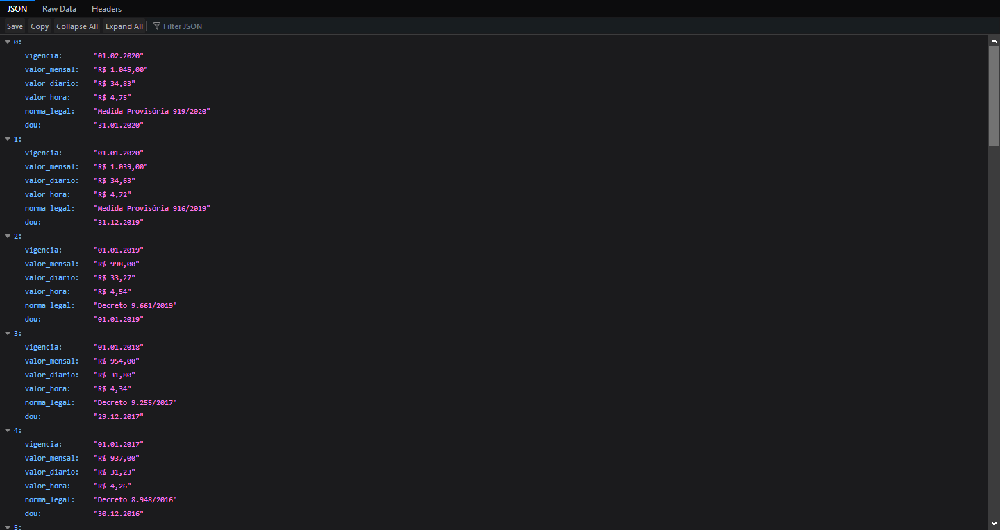
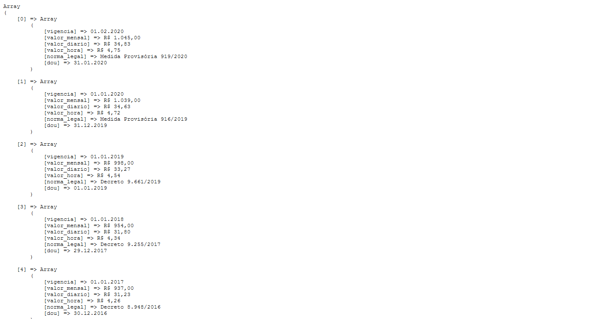

# TestGuzzle
> Projeto de teste

## Instalação

```sh
composer install
php -S localhost:8080 -t app 
```

## Visualização
Por padrão será exibido em array, mas se precisar pode ver em json

| Parâmetro     | Descrição                     |
| ------------- |-------------------------------|
| ?format=json  | Visualiza o dados em json     |
| ?format=array | Ver os dados em array         |

## Estrutura de pasta
```
.
├── app
│   └── index.php
├── .gitignore
├── composer.json
├── json.png
├── array.png
├── Procfile
└── README.md
```    

## Demo
Demo => https://testguzzle.herokuapp.com/

## Pré-Visualização

